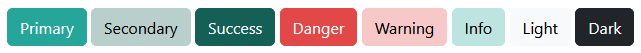

# SITN Bootstrap

This is just Boostrap compiled with SITN colors



## How to compile

```powershell
npm i
sass --style=compressed src:dist
```

Then you can copy `sitn-bootstrap.css` in your project.
